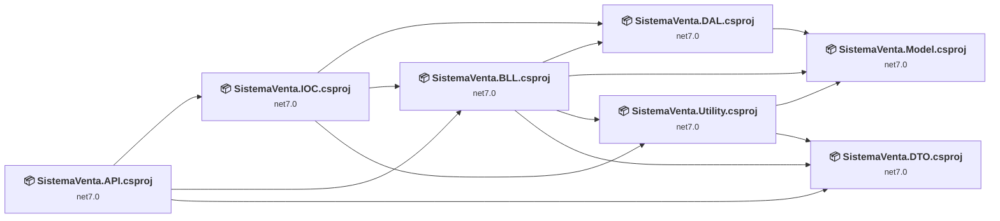
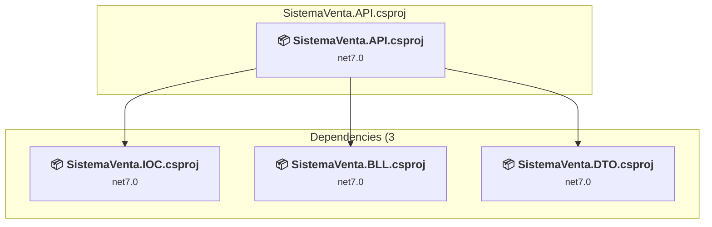
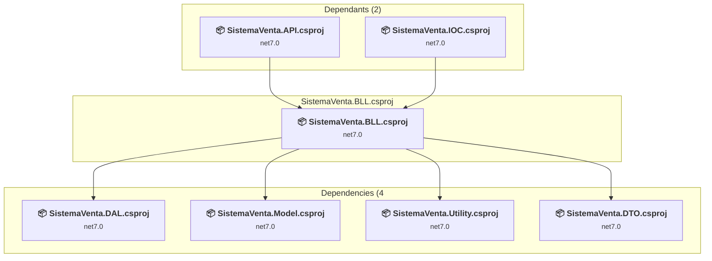
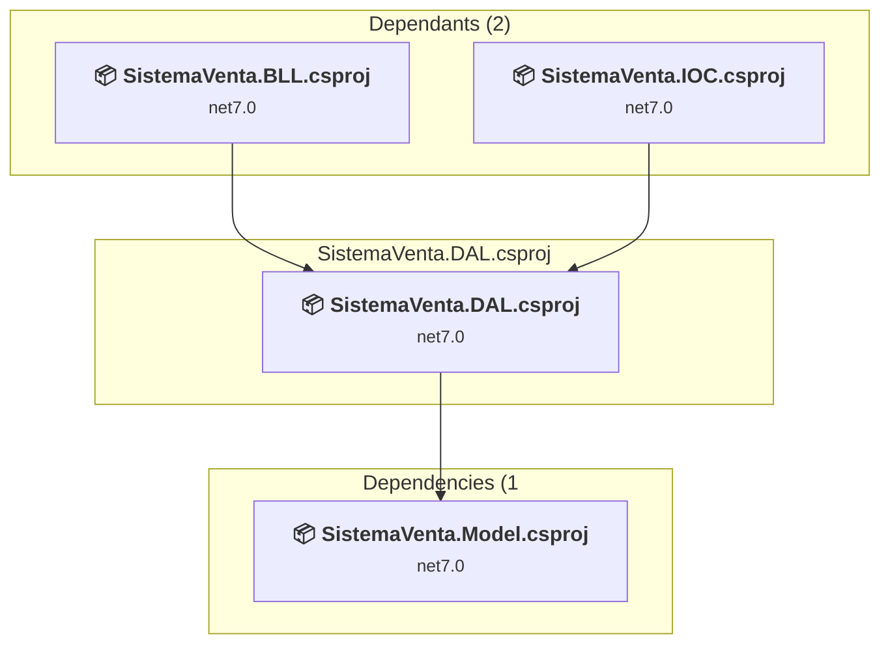
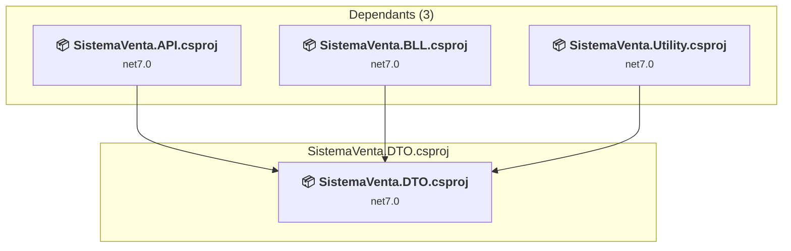
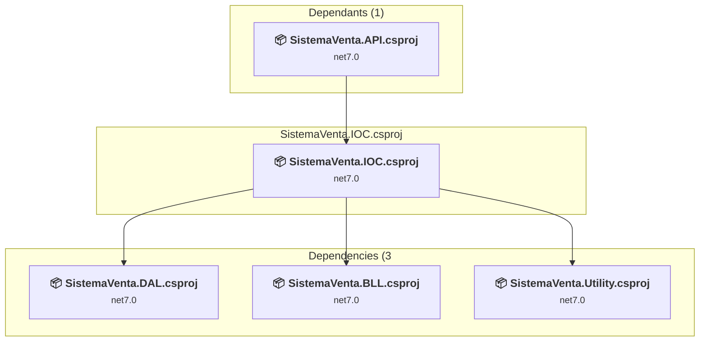
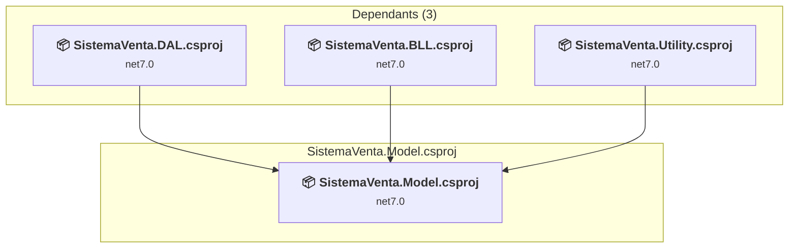
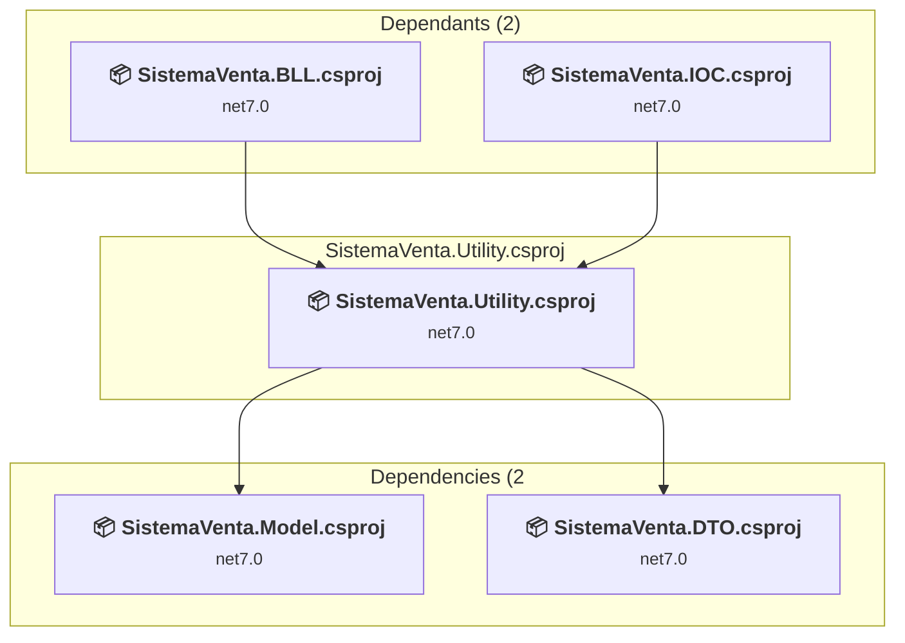

# Projects and dependencies analysis

This document provides a comprehensive overview of the projects and their dependencies in the context of upgrading to .NETCoreApp,Version=v10.0.

## Table of Contents

- [Executive Summary](#executive-Summary)
  - [Highlevel Metrics](#highlevel-metrics)
  - [Projects Compatibility](#projects-compatibility)
  - [Package Compatibility](#package-compatibility)
  - [API Compatibility](#api-compatibility)
- [Aggregate NuGet packages details](#aggregate-nuget-packages-details)
- [Top API Migration Challenges](#top-api-migration-challenges)
  - [Technologies and Features](#technologies-and-features)
  - [Most Frequent API Issues](#most-frequent-api-issues)
- [Projects Relationship Graph](#projects-relationship-graph)
- [Project Details](#project-details)

  - [SistemaVenta.API\SistemaVenta.API.csproj](#sistemaventaapisistemaventaapicsproj)
  - [SistemaVenta.BLL\SistemaVenta.BLL.csproj](#sistemaventabllsistemaventabllcsproj)
  - [SistemaVenta.DAL\SistemaVenta.DAL.csproj](#sistemaventadalsistemaventadalcsproj)
  - [SistemaVenta.DTO\SistemaVenta.DTO.csproj](#sistemaventadtosistemaventadtocsproj)
  - [SistemaVenta.IOC\SistemaVenta.IOC.csproj](#sistemaventaiocsistemaventaioccsproj)
  - [SistemaVenta.Model\SistemaVenta.Model.csproj](#sistemaventamodelsistemaventamodelcsproj)
  - [SistemaVenta.Utility\SistemaVenta.Utility.csproj](#sistemaventautilitysistemaventautilitycsproj)

## Executive Summary

### Highlevel Metrics

| Metric | Count | Status |
| :--- | :---: | :--- |
| Total Projects | 7 | All require upgrade |
| Total NuGet Packages | 6 | 3 need upgrade |
| Total Code Files | 51 |  |
| Total Code Files with Incidents | 8 |  |
| Total Lines of Code | 2325 |  |
| Total Number of Issues | 11 |  |
| Estimated LOC to modify | 1+ | at least 0,0% of codebase |

### Projects Compatibility

| Project | Target Framework | Difficulty | Package Issues | API Issues | Est. LOC Impact | Description |
| :--- | :---: | :---: | :---: | :---: | :---: | :--- |
| [SistemaVenta.API\SistemaVenta.API.csproj](#sistemaventaapisistemaventaapicsproj) | net7.0 | 🟢 Low | 1 | 0 |  | AspNetCore, Sdk Style = True |
| [SistemaVenta.BLL\SistemaVenta.BLL.csproj](#sistemaventabllsistemaventabllcsproj) | net7.0 | 🟢 Low | 0 | 0 |  | ClassLibrary, Sdk Style = True |
| [SistemaVenta.DAL\SistemaVenta.DAL.csproj](#sistemaventadalsistemaventadalcsproj) | net7.0 | 🟢 Low | 0 | 0 |  | ClassLibrary, Sdk Style = True |
| [SistemaVenta.DTO\SistemaVenta.DTO.csproj](#sistemaventadtosistemaventadtocsproj) | net7.0 | 🟢 Low | 0 | 0 |  | ClassLibrary, Sdk Style = True |
| [SistemaVenta.IOC\SistemaVenta.IOC.csproj](#sistemaventaiocsistemaventaioccsproj) | net7.0 | 🟢 Low | 0 | 1 | 1+ | ClassLibrary, Sdk Style = True |
| [SistemaVenta.Model\SistemaVenta.Model.csproj](#sistemaventamodelsistemaventamodelcsproj) | net7.0 | 🟢 Low | 2 | 0 |  | ClassLibrary, Sdk Style = True |
| [SistemaVenta.Utility\SistemaVenta.Utility.csproj](#sistemaventautilitysistemaventautilitycsproj) | net7.0 | 🟢 Low | 0 | 0 |  | ClassLibrary, Sdk Style = True |

### Package Compatibility

| Status | Count | Percentage |
| :--- | :---: | :---: |
| ✅ Compatible | 3 | 50,0% |
| ⚠️ Incompatible | 0 | 0,0% |
| 🔄 Upgrade Recommended | 3 | 50,0% |
| ***Total NuGet Packages*** | ***6*** | ***100%*** |

### API Compatibility

| Category | Count | Impact |
| :--- | :---: | :--- |
| 🔴 Binary Incompatible | 1 | High - Require code changes |
| 🟡 Source Incompatible | 0 | Medium - Needs re-compilation and potential conflicting API error fixing |
| 🔵 Behavioral change | 0 | Low - Behavioral changes that may require testing at runtime |
| ✅ Compatible | 2543 |  |
| ***Total APIs Analyzed*** | ***2544*** |  |

## Aggregate NuGet packages details

| Package | Current Version | Suggested Version | Projects | Description |
| :--- | :---: | :---: | :--- | :--- |
| AutoMapper | 12.0.0 |  | [SistemaVenta.Utility.csproj](#sistemaventautilitysistemaventautilitycsproj) | ✅Compatible |
| AutoMapper.Extensions.Microsoft.DependencyInjection | 12.0.0 |  | [SistemaVenta.Utility.csproj](#sistemaventautilitysistemaventautilitycsproj) | ✅Compatible |
| Microsoft.AspNetCore.OpenApi | 7.0.5 | 10.0.3 | [SistemaVenta.API.csproj](#sistemaventaapisistemaventaapicsproj) | Se recomienda actualizar el paquete NuGet |
| Microsoft.EntityFrameworkCore.SqlServer | 7.0.1 | 10.0.3 | [SistemaVenta.Model.csproj](#sistemaventamodelsistemaventamodelcsproj) | Se recomienda actualizar el paquete NuGet |
| Microsoft.EntityFrameworkCore.Tools | 7.0.1 | 10.0.3 | [SistemaVenta.Model.csproj](#sistemaventamodelsistemaventamodelcsproj) | Se recomienda actualizar el paquete NuGet |
| Swashbuckle.AspNetCore | 6.4.0 |  | [SistemaVenta.API.csproj](#sistemaventaapisistemaventaapicsproj) | ✅Compatible |

## Top API Migration Challenges

### Technologies and Features

| Technology | Issues | Percentage | Migration Path |
| :--- | :---: | :---: | :--- |

### Most Frequent API Issues

| API | Count | Percentage | Category |
| :--- | :---: | :---: | :--- |
| T:Microsoft.Extensions.DependencyInjection.ServiceCollectionExtensions | 1 | 100,0% | Binary Incompatible |

## Projects Relationship Graph

Legend:
📦 SDK-style project
⚙️ Classic project

## Project Details

### SistemaVenta.API\SistemaVenta.API.csproj

#### Project Info

- **Current Target Framework:** net7.0
- **Proposed Target Framework:** net10.0
- **SDK-style**: True
- **Project Kind:** AspNetCore
- **Dependencies**: 3
- **Dependants**: 0
- **Number of Files**: 11
- **Number of Files with Incidents**: 1
- **Lines of Code**: 539
- **Estimated LOC to modify**: 0+ (at least 0,0% of the project)

#### Dependency Graph

Legend:
📦 SDK-style project
⚙️ Classic project

### API Compatibility

| Category | Count | Impact |
| :--- | :---: | :--- |
| 🔴 Binary Incompatible | 0 | High - Require code changes |
| 🟡 Source Incompatible | 0 | Medium - Needs re-compilation and potential conflicting API error fixing |
| 🔵 Behavioral change | 0 | Low - Behavioral changes that may require testing at runtime |
| ✅ Compatible | 389 |  |
| ***Total APIs Analyzed*** | ***389*** |  |

### SistemaVenta.BLL\SistemaVenta.BLL.csproj

#### Project Info

- **Current Target Framework:** net7.0
- **Proposed Target Framework:** net10.0
- **SDK-style**: True
- **Project Kind:** ClassLibrary
- **Dependencies**: 4
- **Dependants**: 2
- **Number of Files**: 14
- **Number of Files with Incidents**: 1
- **Lines of Code**: 723
- **Estimated LOC to modify**: 0+ (at least 0,0% of the project)

#### Dependency Graph

Legend:
📦 SDK-style project
⚙️ Classic project

### API Compatibility

| Category | Count | Impact |
| :--- | :---: | :--- |
| 🔴 Binary Incompatible | 0 | High - Require code changes |
| 🟡 Source Incompatible | 0 | Medium - Needs re-compilation and potential conflicting API error fixing |
| 🔵 Behavioral change | 0 | Low - Behavioral changes that may require testing at runtime |
| ✅ Compatible | 502 |  |
| ***Total APIs Analyzed*** | ***502*** |  |

### SistemaVenta.DAL\SistemaVenta.DAL.csproj

#### Project Info

- **Current Target Framework:** net7.0
- **Proposed Target Framework:** net10.0
- **SDK-style**: True
- **Project Kind:** ClassLibrary
- **Dependencies**: 1
- **Dependants**: 2
- **Number of Files**: 5
- **Number of Files with Incidents**: 1
- **Lines of Code**: 448
- **Estimated LOC to modify**: 0+ (at least 0,0% of the project)

#### Dependency Graph

Legend:
📦 SDK-style project
⚙️ Classic project

### API Compatibility

| Category | Count | Impact |
| :--- | :---: | :--- |
| 🔴 Binary Incompatible | 0 | High - Require code changes |
| 🟡 Source Incompatible | 0 | Medium - Needs re-compilation and potential conflicting API error fixing |
| 🔵 Behavioral change | 0 | Low - Behavioral changes that may require testing at runtime |
| ✅ Compatible | 684 |  |
| ***Total APIs Analyzed*** | ***684*** |  |

### SistemaVenta.DTO\SistemaVenta.DTO.csproj

#### Project Info

- **Current Target Framework:** net7.0
- **Proposed Target Framework:** net10.0
- **SDK-style**: True
- **Project Kind:** ClassLibrary
- **Dependencies**: 0
- **Dependants**: 3
- **Number of Files**: 12
- **Number of Files with Incidents**: 1
- **Lines of Code**: 232
- **Estimated LOC to modify**: 0+ (at least 0,0% of the project)

#### Dependency Graph

Legend:
📦 SDK-style project
⚙️ Classic project

### API Compatibility

| Category | Count | Impact |
| :--- | :---: | :--- |
| 🔴 Binary Incompatible | 0 | High - Require code changes |
| 🟡 Source Incompatible | 0 | Medium - Needs re-compilation and potential conflicting API error fixing |
| 🔵 Behavioral change | 0 | Low - Behavioral changes that may require testing at runtime |
| ✅ Compatible | 212 |  |
| ***Total APIs Analyzed*** | ***212*** |  |

### SistemaVenta.IOC\SistemaVenta.IOC.csproj

#### Project Info

- **Current Target Framework:** net7.0
- **Proposed Target Framework:** net10.0
- **SDK-style**: True
- **Project Kind:** ClassLibrary
- **Dependencies**: 3
- **Dependants**: 1
- **Number of Files**: 1
- **Number of Files with Incidents**: 2
- **Lines of Code**: 45
- **Estimated LOC to modify**: 1+ (at least 2,2% of the project)

#### Dependency Graph

Legend:
📦 SDK-style project
⚙️ Classic project

### API Compatibility

| Category | Count | Impact |
| :--- | :---: | :--- |
| 🔴 Binary Incompatible | 1 | High - Require code changes |
| 🟡 Source Incompatible | 0 | Medium - Needs re-compilation and potential conflicting API error fixing |
| 🔵 Behavioral change | 0 | Low - Behavioral changes that may require testing at runtime |
| ✅ Compatible | 41 |  |
| ***Total APIs Analyzed*** | ***42*** |  |

### SistemaVenta.Model\SistemaVenta.Model.csproj

#### Project Info

- **Current Target Framework:** net7.0
- **Proposed Target Framework:** net10.0
- **SDK-style**: True
- **Project Kind:** ClassLibrary
- **Dependencies**: 0
- **Dependants**: 3
- **Number of Files**: 9
- **Number of Files with Incidents**: 1
- **Lines of Code**: 171
- **Estimated LOC to modify**: 0+ (at least 0,0% of the project)

#### Dependency Graph

Legend:
📦 SDK-style project
⚙️ Classic project

### API Compatibility

| Category | Count | Impact |
| :--- | :---: | :--- |
| 🔴 Binary Incompatible | 0 | High - Require code changes |
| 🟡 Source Incompatible | 0 | Medium - Needs re-compilation and potential conflicting API error fixing |
| 🔵 Behavioral change | 0 | Low - Behavioral changes that may require testing at runtime |
| ✅ Compatible | 186 |  |
| ***Total APIs Analyzed*** | ***186*** |  |

### SistemaVenta.Utility\SistemaVenta.Utility.csproj

#### Project Info

- **Current Target Framework:** net7.0
- **Proposed Target Framework:** net10.0
- **SDK-style**: True
- **Project Kind:** ClassLibrary
- **Dependencies**: 2
- **Dependants**: 2
- **Number of Files**: 1
- **Number of Files with Incidents**: 1
- **Lines of Code**: 167
- **Estimated LOC to modify**: 0+ (at least 0,0% of the project)

#### Dependency Graph

Legend:
📦 SDK-style project
⚙️ Classic project

### API Compatibility

| Category | Count | Impact |
| :--- | :---: | :--- |
| 🔴 Binary Incompatible | 0 | High - Require code changes |
| 🟡 Source Incompatible | 0 | Medium - Needs re-compilation and potential conflicting API error fixing |
| 🔵 Behavioral change | 0 | Low - Behavioral changes that may require testing at runtime |
| ✅ Compatible | 529 |  |
| ***Total APIs Analyzed*** | ***529*** |  |

