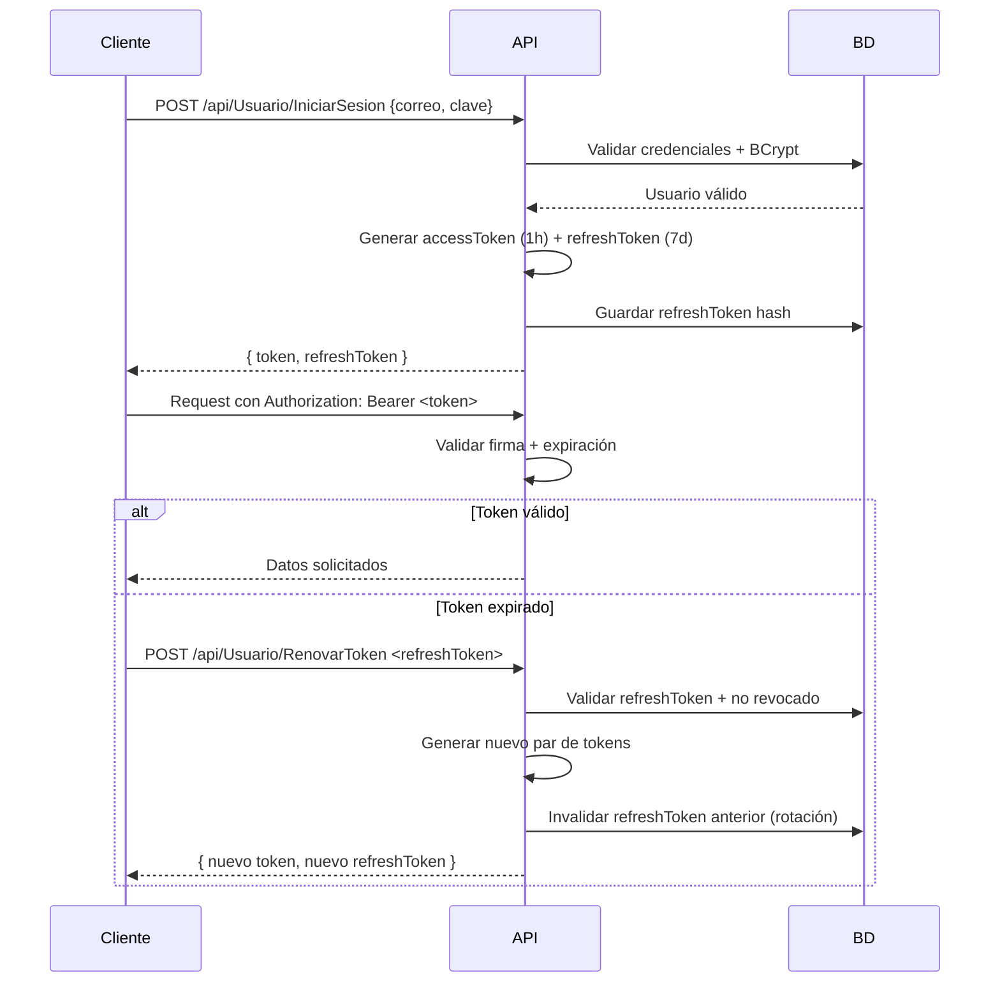

# Sistema de Ventas — API .NET 10

> API REST robusta para gestión de ventas, desarrollada con **.NET 10**, **Entity Framework Core** y **SQL Server**. Implementa autenticación JWT con Refresh Tokens, arquitectura en capas y está containerizada con Docker para consistencia entre entornos.

[](https://dotnet.microsoft.com)
[](https://www.docker.com)
[](https://www.microsoft.com/sql-server)
[](LICENSE)

---

## 📖 Descripción

Este backend proporciona endpoints REST para un sistema de ventas completo: autenticación de usuarios, gestión de productos, categorías, registro de ventas y reportes. Diseñado con principios de Clean Architecture y preparado para despliegue reproducible con Docker.

**Características principales:**
- ✅ Autenticación stateless con JWT + Refresh Token rotation
- ✅ Hashing de contraseñas con BCrypt
- ✅ Validación de datos con Data Annotations + FluentValidation
- ✅ Documentación interactiva con Scalar (OpenAPI)
- ✅ Arquitectura N-Tier: API → BLL → DAL → Model/DTO
- ✅ Docker multi-stage para imágenes ligeras (~180MB)

---

## 🛡️ Arquitectura de Seguridad

### Flujo de Autenticación JWT



### Medidas de seguridad implementadas

| Medida | Implementación | Propósito |
|--------|---------------|-----------|
| **BCrypt hashing** | `BCrypt.Net.BCrypt.HashPassword()` | Protección contra rainbow tables |
| **JWT HMAC-SHA256** | Firma con clave secreta en variables de entorno | Integridad y autenticidad del token |
| **Refresh Token rotation** | Invalidación en BD al usar refreshToken | Mitiga robo de tokens |
| **CORS policies** | Políticas por ambiente (`DesarrolloLocal`, `Produccion`) | Previene ataques CSRF desde orígenes no autorizados |
| **Rate limiting** | `AddRateLimiter` con 100 req/min por cliente | Protege contra fuerza bruta y abuso |
| **Security headers** | Middleware personalizado (`X-Content-Type-Options`, etc.) | Previene clickjacking, XSS, MIME sniffing |

---

## 🛠️ Stack Tecnológico

| Capa | Tecnología | Versión |
|------|-----------|---------|
| **Runtime** | .NET 10 ASP.NET Core Web API | 10.0.x |
| **ORM** | Entity Framework Core | 10.0.x |
| **Base de datos** | SQL Server | 2022 Developer |
| **Autenticación** | JWT + BCrypt + Refresh Tokens | - |
| **Documentación** | Scalar (OpenAPI 3.0) | Latest |
| **Mapeo** | AutoMapper | 16.x |
| **Testing** | xUnit + Moq | Latest |
| **Containerización** | Docker multi-stage + Alpine | - |

---

## 🚀 Endpoints Clave

### 🔐 Autenticación

| Método | Endpoint | Descripción | Auth |
|--------|----------|-------------|------|
| `POST` | `/api/Usuario/IniciarSesion` | Login: recibe `{correo, clave}`, devuelve tokens | ❌ |
| `POST` | `/api/Usuario/RenovarToken` | Refresh: recibe refreshToken raw, devuelve nuevo par | ❌ |

**Ejemplo de respuesta login:**
```json
{
  "token": "eyJhbGciOiJIUzI1NiIsInR5cCI6IkpXVCJ9...",
  "refreshToken": "a1b2c3d4-e5f6-7890-g1h2-i3j4k5l6m7n8"
}
```

### 👥 Usuario (Admin)

| Método | Endpoint | Descripción | Auth |
|--------|----------|-------------|------|
| `GET` | `/api/Usuario/Lista` | Listar usuarios activos | ✅ JWT |
| `POST` | `/api/Usuario/Guardar` | Crear nuevo usuario | ✅ JWT + Rol Admin |
| `PUT` | `/api/Usuario/Editar` | Actualizar usuario | ✅ JWT + Propietario/Admin |

### 📦 Productos & Ventas

| Método | Endpoint | Descripción | Auth |
|--------|----------|-------------|------|
| `GET` | `/api/Producto/Lista` | Listar productos con stock | ✅ JWT |
| `POST` | `/api/Venta/Registrar` | Registrar nueva venta | ✅ JWT |
| `GET` | `/api/Venta/Reporte?fechaInicio&fechaFin` | Reporte de ventas por rango | ✅ JWT + Rol Admin |

---

## ⚙️ Instalación y Ejecución

### Opción A: Desarrollo local (sin Docker)

```powershell
# 1. Clonar repositorio
git clone https://github.com/jotalexvalencia/APISistemaVenta.git
cd APISistemaVenta

# 2. Configurar conexión a BD local
# Editar appsettings.Development.json:
# "ConnectionStrings": { "cadenaSQL": "Server=YOUR_SERVER;Database=DBVENTAngular;Trusted_Connection=True;..." }

# 3. Restaurar y ejecutar
dotnet restore
dotnet run

# 4. Acceder a documentación
# Navegar a: http://localhost:5018/scalar/v1
```

### Opción B: Docker (Recomendado — Entorno reproducible)

```powershell
# 1. Crear archivo .env desde plantilla
cp .env.example .env
# ⚠️ Editar .env con valores seguros. NUNCA commitear .env con secrets reales.

# 2. Levantar stack completo (API + SQL Server)
docker-compose up -d

# 3. Verificar estado
docker-compose ps
# Esperar: sqlserver (healthy), api (Up)

# 4. Acceder a la API
# http://localhost:8080/scalar/v1

# 5. Ver logs si hay error
docker-compose logs api
docker-compose logs sqlserver
```

### Variables de entorno críticas (.env)

| Variable | Propósito | Ejemplo seguro |
|----------|-----------|---------------|
| `MSSQL_SA_PASSWORD` | Contraseña de SQL Server (policy: 8+ chars, mayúscula, número, símbolo) | `MiClave123!` |
| `JWT_KEY` | Clave para firmar tokens (mínimo 32 caracteres) | `Mi_Clave_Secreta_2026_Super_Larga...` |

> 🔐 **Seguridad**: Los secrets van en `.env` (agregado a `.gitignore`). Nunca commitees `.env` con valores reales. Usa Azure Key Vault o similar en producción.

---

## 🐳 Docker & Entornos Reproducibles

### Arquitectura de contenedores

```
┌─────────────────────────────────────┐
│   docker-compose.yml                │
│   ┌─────────────┐ ┌─────────────┐  │
│   │   api       │ │ sqlserver   │  │
│   │  (Alpine)   │ │ (2022-dev)  │  │
│   │  ~180MB     │ │ + volume    │  │
│   └──────┬──────┘ └──────┬──────┘  │
│          │               │          │
│   ┌──────▼───────────────▼──────┐  │
│   │   Red: sistemaventa-net     │  │
│   │   Comunicación por nombre   │  │
│   │   api ↔ sqlserver:1433      │  │
│   └─────────────────────────────┘  │
└─────────────────────────────────────┘
```

### Optimizaciones del Dockerfile

| Técnica | Implementación | Beneficio |
|---------|---------------|-----------|
| **Multi-stage build** | Stage `build` (SDK) + `runtime` (ASP.NET) | Imagen final ~180MB vs ~900MB sin optimizar |
| **Alpine Linux** | `mcr.microsoft.com/dotnet/sdk:10.0-alpine` | Menor superficie de ataque + descarga más rápida |
| **Layer caching** | COPY `.csproj` antes que `COPY . .` | Build incremental: solo recompila si cambia código |
| **Non-root user** | `adduser -D appuser` + `USER appuser` | Cumple principio de mínimo privilegio |
| **.dockerignore** | Excluye `bin/`, `obj/`, `.git`, `docs/` | Contexto pequeño (~50MB) → build 10x más rápido |

### Comandos útiles de Docker

```powershell
# Construir imagen manualmente
docker build -t sistemaventa-api:v1 -f Dockerfile .

# Ejecutar contenedor suelto (sin compose)
docker run -d -p 8080:8080 --name api-test sistemaventa-api:v1

# Entrar al contenedor para debugging
docker exec -it sistemaventa-api sh

# Limpiar contenedores detenidos (sin perder datos)
docker rm $(docker ps -a -q -f status=exited)

# Reset completo (⚠️ BORRA DATOS de SQL Server)
docker-compose down -v  # El -v elimina el volumen sqldata
```

---

## 🧪 Evidencia de Implementación

- ✅ JWT con Refresh Token rotation (invalidación en BD al usar)
- ✅ BCrypt para hashing de contraseñas (60-char hashes en `varchar(255)`)
- ✅ Healthcheck nativo en SQL Server + `depends_on: condition: service_healthy`
- ✅ Imagen multi-stage Alpine: ~180MB vs ~900MB sin optimizar
- ✅ CORS policies segregadas por ambiente (`DesarrolloLocal` vs `Produccion`)
- ✅ Rate limiting nativo (.NET 7+) con 100 req/min por cliente
- ✅ Security headers personalizados (`X-Content-Type-Options`, `X-Frame-Options`, etc.)
- ✅ Documentación técnica profunda en `/docs/docker/`

---

## 📚 Documentación Técnica Profunda

Para detalles de implementación Docker (multi-stage, caching, networking, troubleshooting), consultar:

| Archivo | Contenido |
|---------|-----------|
| `/docs/docker/01-dockerizacion-api.md` | Dockerfile .NET 10: análisis línea por línea, trade-offs, errores comunes |
| `/docs/docker/02-dockerizacion-sqlserver.md` | SQL Server en Docker: persistencia, healthcheck, variables de entorno |
| `/docs/docker/04-docker-compose.md` | Orquestación de servicios: redes, dependencias, volúmenes |
| `/docs/docker/05-troubleshooting.md` | Flujo de diagnóstico: comandos, errores reales y soluciones |

> 📌 **Nivel de dominio (ENGRAM)**: 🔄 Lo puedo repetir sin ayuda  
> *Honestidad técnica: Implementado guiado, con comprensión de trade-offs y diagnóstico. Pendiente: aplicar en pipeline de CI/CD con registry y despliegue automático.*

---

## 🔧 Troubleshooting Rápido

```powershell
# API no responde en localhost:8080
docker-compose logs api  # Verificar errores de startup

# Error "Login failed for user 'sa'"
# → Verificar que MSSQL_SA_PASSWORD cumple política de SQL Server

# Error "Cannot connect to sqlserver:1433"
# → Verificar que ambos servicios están en networks: - sistemaventa-net
# → Verificar connection string: Server=sqlserver,1433 (no localhost)

# Healthcheck de SQL Server falla
docker exec sistemaventa-sqlserver /opt/mssql-tools18/bin/sqlcmd -S localhost -U sa -P "${env:MSSQL_SA_PASSWORD}" -Q "SELECT 1"

# Puerto 8080 ya está en uso
netstat -ano | findstr :8080  # Ver PID
taskkill /PID <PID> /F         # O cambiar puerto en compose: "8081:8080"
```

---

## 👤 Autor

**Jorge Alexander Valencia Valencia**  
Desarrollador de Software — Colombia

🔗 [LinkedIn](https://www.linkedin.com/in/jorgealexandervalencia/)  
🔗 [GitHub](https://github.com/jotalexvalencia)  
🔗 [Portafolio](https://jorgevalencia.dev) *(próximamente)*

---

> 📄 **Licencia**: MIT — Libre uso con atribución.  
> 🔄 **Última actualización**: Mayo 2026 — .NET 10 + Docker multi-stage + Alpine
```